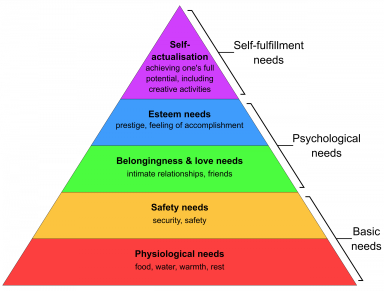

= Fork Yourself
:hide-uri-scheme:
:figure-caption!:

== A Cognitive 'Stack' of personality systems for Individuals

[square]
* MBTI - https://sakinorva.net/functions
* Enneagram - https://enneagram-personality.com/
* Chinese Zodiac - https://whatzodiac.com/chinese-zodiac-calculator/
* Astrology - https://astro.cafeastrology.com/natal.php
* Human Design Chart - https://freehumandesignchart.com/

Using the above systems as 'facets' or as a single outline, individuals can better visualize their own Metacognition, Subcognition and Bio/Neurological behavior in an accessible format.

=== How to 'Fork' your Self
Follow and complete each of the systems above.

Take each of the results and spend a little time learning each system.

MBTI & Enneagram tests have a self reporting bias, so do some investigative work, compare and contrast each recommended type in your results with a trusted friend, spouse, search engine or AI of choice.

Astrology symbols that denote behavior are the Sun(Core), Moon(Heart) and Ascendant(Appearance)

The human design chart 'Type' and 'Definition' denotes energy flow to others, and within respectively.

Results when overlayed look like the following Example:

    ISFP, 9w8, Water Rabbit, Taurus Sun Taurus Moon Saggitarius Ascendant, Manifesting Generator (Single Definition)
    

=== Why create this?

Most modern people live their lives according to an identity shaped by external pressures.

Modern narratives, interests and technology aim to tell people outright:

* how we are supposed to live
* what we are supposed to do
* what we are supposed to think

But seldom are we able to define 'why':

* why we do the things we do
* why we think the things we do

=== Theory / Chain of Thought / Philosophy
==== Is Identity Composable?

Often the thought experiment is posed:

    "If you had all the money you could ever need, what would you do?"

Put humans in nature, according to biology they will desire to:

* secure food, clothing, shelter
* establish connection and status

Modern systems have made the effort and cost of achieving this easier, while increasing the expectations and complexity of what the fulfullment of each need is 'supposed to look like' in different objects or objectives:

* food products, michelin star restaurants
* a house, a high rise suite
* marriage, polyamory

    Are we able to say we live in a society of self-actualized people?

Our Identity as humans is usually thought of in three general ways or subsystems:

* biological inheritance (body)
* reinforced learning (mind)
* innate personality (soul)

In general, these three 'needs' of these systems are at odds with one another.

So many people attempt to find meaning and purpose via traditional, societal, parental, environmental, historical, religious, philosophical, scientific methods as a catch-all solution. This creates a Bazaar of 'Identity Products' without a navigable compass for the individual.

If we continue to treat our identity as tribal and monolithic, we risk betraying our need for self actualization.

Hopefully this theory helps avoid the systemic failure of self-betrayal, the mind commiting to a path the body and soul cannot sustain.

Discovering an identity that is congruent with our internal self, moves us from being consumers of identity to authors of it.

Distributed under the link:LICENSE[MIT License]. Fork Me!
